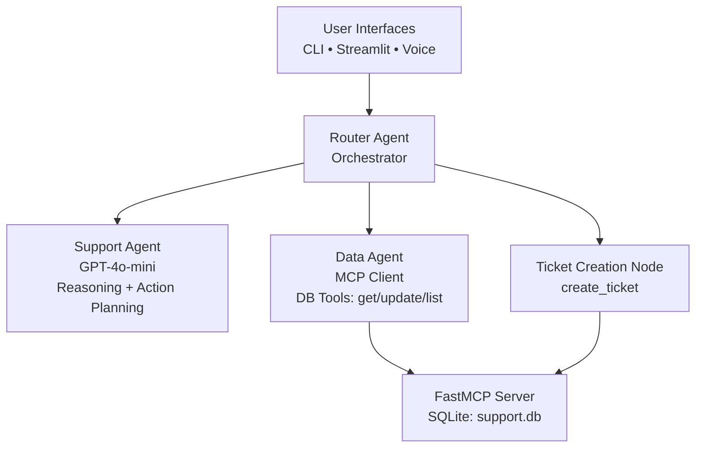

# Multi-Agent Customer Support System  
### MCP-Powered • OpenAI GPT-4o-mini • LangGraph-Style Routing • SQLite-Grounded

This project implements a fully functional **multi-agent customer support platform** built for the Applied Generative AI course at the University of Chicago.  
It combines **LLM reasoning**, **database-backed tools**, **MCP**, **LangGraph-style orchestration**, and **multimodal interfaces** (text + voice).

---

## Project Overview

This system simulates an intelligent customer support workflow. Three core agents collaborate to:

- Understand user intent  
- Retrieve customer details  
- Resolve multi-step queries  
- Create or update support tickets  
- Provide helpful natural-language responses  
- Interact through CLI, Streamlit Web UI, or speech-to-speech interface  

The pipeline is **grounded in a real SQLite database** via an MCP Server (FastMCP), and orchestrated by a **custom Router Agent** inspired by LangGraph.

---

## Project Structure

```bash
MULTIAGENT-CUSTOMER-SUPPORT/
├── agents/                 # Multi-agent logic
│   ├── data_agent.py       # MCP client
│   ├── router_agent.py     # LangGraph-style orchestrator
│   └── support_agent.py    # GPT-4o-mini reasoning
│
├── demo/                   # Homework test cases
│   └── run_demo.py
│
├── extras/                 # Optional UI components
│   ├── chat_cli.py         # CLI demo 
│   ├── streamlit_app.py    # Web UI
│   └── voice_chat.py       # Speech-to-speech assistant
│
├── mcp_server/ # MCP Server + SQLite grounding
│   ├── database_setup.py
│   ├── server.py
│   └── support.db # SQLite database
│
├── README.md
├── setup.py
└── .gitignore
```

---

## System Architecture



---

## Features

### Support Agent (GPT-4o-mini)
- Intent classification  
- Multi-intent detection  
- Action planning (respond, request_data, create_ticket)  
- Structured JSON output for routing  

### Data Agent (MCP Client)
- Calls MCP server via StdioTransport  
- Exposes tool functions:
  - `get_customer`
  - `list_customers`
  - `update_customer`
  - `get_customer_history`
  - `create_ticket`

### MCP Server (FastMCP + SQLite)
- Persistent storage  
- Database-backed tool functions  
- Deterministic grounding for LLMs  

### Router Agent (LangGraph Style)
- Multi-step reasoning  
- Node-based routing  
- Condition-driven transitions  
- Final response synthesis  

### User Interfaces
- CLI chat  
- Automated HW scenario runner  
- Streamlit web UI  
- Full speech-to-speech interaction (Whisper + TTS)

---

## Installation

### 1. Clone the repo
``` python
git clone https://github.com/XuYunlei/multiagent-customer-support.git
cd multiagent-customer-support
```

### 2. Create environment
``` python
conda create -n mcp python=3.10 -y
conda activate mcp
```

### 3. Install dependencies
``` python
pip install -r requirements.txt
pip install streamlit sounddevice simpleaudio pydub
brew install ffmpeg
```

---

## How to Run

### 🔹 Test Scenarios
``` python
python demo/run_demo.py
```

### 🔹 Interactive CLI Chat
``` python
python extras/chat_cli.py
```

### 🔹 Streamlit Web App
``` python
streamlit run extras/streamlit_app.py
```

### 🔹 Speech-to-Speech Voice Assistant
``` python
python extras/voice_chat.py
```

---

## End-to-End Demonstration (A2A Coordination)

Below are the outputs from running `python demo/run_demo.py`:

All five scenarios demonstrate multi-step agent coordination between the **Router Agent**, **Support Agent (GPT-4o-mini)**, and **Data Agent (MCP)** using real database grounding via the MCP Server.

---

### ⭐ **Scenario 1 — Account Status**
**User:** *“Hi, what's the status of my account?”*
```
Router → Received query
Support Agent → action = request_data
Data Agent → customer_id=1 found, 2 tickets retrieved
Support Agent → action = respond
Final Answer → "Hi John Doe, your account is currently active..."
```

---

### ⭐ **Scenario 2 — Double Charge Issue**
**User:** *“I was charged twice this month, please help!”*
```
Router → Received query
Support Agent → action = request_data
Data Agent → customer details loaded
Support Agent → action = create_ticket
Router → Ticket created (id=5, priority=high)
Final Answer → Ticket summary + confirmation
```

**Final Answer Includes:**
- ID: 5  
- Status: open  
- Priority: high  

---

### ⭐ **Scenario 3 — Multi-Intent Issue (Upgrade + Login Problem)**
**User:** *“I want to upgrade my account and also fix my login issue.”*
```
Support Agent → detects multiple intents
Support Agent → action = request_data
Data Agent → loads 3 active tickets
Support Agent → action = respond
Final Answer → Addresses upgrade + login issue with prioritization
```

---

### ⭐ **Scenario 4 — Retrieve All Tickets**
**User:** *“Show me all my tickets.”*
```
Support Agent → action = request_data
Data Agent → loads customer + tickets
Support Agent → action = respond
Final Answer → Lists all active tickets with status + priority
```

**Returned:**
1. Double charge — Open (High)  
2. Unable to login — Open (High)  
3. Plan upgrade — In Progress (Medium)

---

### ⭐ **Scenario 5 — Update Email**
**User:** *“Please update my email to new_email@gmail.com”*
```
Support Agent → action = request_data
Data Agent → loads customer data
Support Agent → action = respond
Final Answer → "Your email has been successfully updated..."
```

---

### ✔ Summary

These scenarios demonstrate:

- Multi-step reasoning  
- Agent-to-agent coordination  
- Tool grounding via MCP  
- Ticket creation workflow  
- Context-dependent responses  
- SQLite-backed state persistence  

---

## **Conclusion**

Throughout this project, I gained a much deeper understanding of what it means to build *true* multi-agent systems beyond simple LLM prompts. Implementing the MCP server taught me how to ground an agent’s reasoning with reliable, tool-based data access. Building the Data Agent helped me understand how to structure tool calls asynchronously and how to connect LLMs with real databases in a safe and repeatable way. Designing the Support Agent with structured JSON outputs strengthened my understanding of controlled reasoning, action planning, and multi-step workflows. The Router Agent was the most challenging piece, but it taught me how to orchestrate interactions between multiple agents in a way that mirrors real LangGraph-style architectures. This experience made agentic systems “click” for me conceptually.

The biggest challenges were debugging asynchronous MCP processes, managing multiple environments, and connecting audio I/O for speech-to-speech interactions. Integrating voice input and TTS pushed me outside of simple text-only pipelines and helped me understand how multimodal agents are built in practice. I also faced several practical engineering challenges—import path issues, virtual environment conflicts, and ensuring the database persisted correctly across agent calls—but overcoming these made me a much more confident, resourceful engineer. Overall, this project gave me hands-on experience building a complete, production-style multi-agent architecture and strengthened my skills in tool grounding, orchestration, and system-level AI design.

---

## Skills Demonstrated

- Multi-Agent Systems  
- Model Context Protocol (MCP)  
- FastMCP Server Development  
- OpenAI GPT-4o-mini (LLM Reasoning)  
- OpenAI Whisper (ASR)  
- OpenAI TTS (Speech Generation)  
- Async Python (asyncio)  
- SQLite database design  
- Tool-grounded LLMs  
- LangGraph-style orchestration  
- Streamlit UI development  
- Audio processing (sounddevice, pydub)  

---

## Future Enhancements

- Multi-turn session memory  
- Dashboard for customer & ticket management  
- Integration with external APIs  
- RAG-enhanced support answers  
- Multi-user support with authentication  
- Persistent voice history  

---

## Acknowledgements  
Course: *Applied Generative AI and Multi-Modal Intelligence*  
University of Chicago, 2025  

