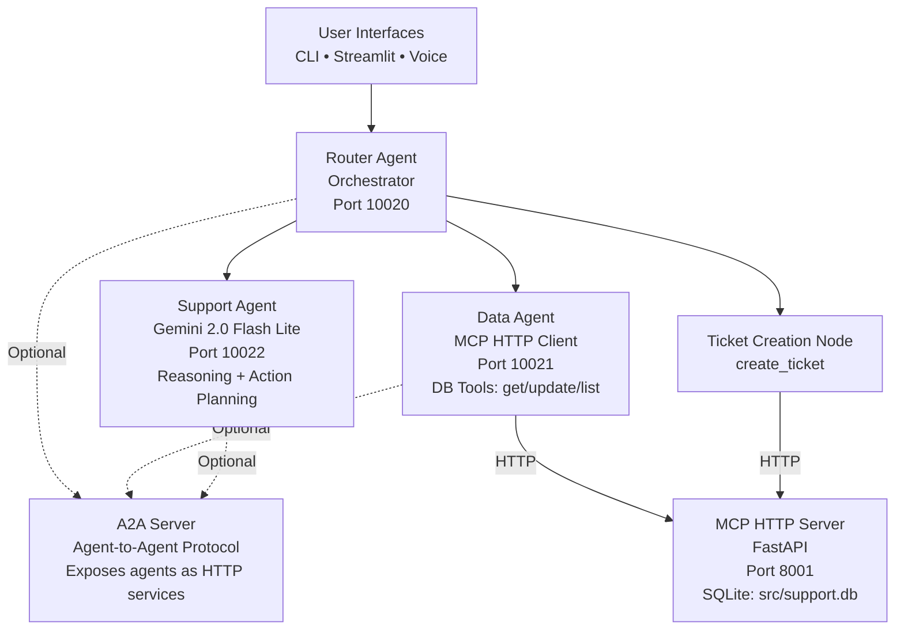

# Multi-Agent Customer Support System  
### MCP-Powered • Google Gemini 2.0 Flash Lite • A2A Protocol • SQLite-Grounded

This project implements a fully functional **multi-agent customer support platform** built for the Applied Generative AI course at the University of Chicago.  
It combines **LLM reasoning**, **database-backed tools**, **MCP**, **LangGraph-style orchestration**, and **multimodal interfaces** (text + voice).

---

## Project Overview

This system simulates an intelligent customer support workflow. Three core agents collaborate to:

- Understand user intent  
- Retrieve customer details  
- Resolve multi-step queries  
- Create or update support tickets  
- Provide helpful natural-language responses  
- Interact through CLI, Streamlit Web UI, or speech-to-speech interface  

The pipeline is **grounded in a real SQLite database** via an MCP Server (FastMCP), and orchestrated by a **custom Router Agent** inspired by LangGraph.

---

## Project Structure

```bash
MULTIAGENT-CUSTOMER-SUPPORT/
├── agents/                 # Multi-agent logic
│   ├── a2a_server.py       # Agent-to-Agent HTTP server
│   ├── data_agent.py       # MCP HTTP client
│   ├── router_agent.py     # LangGraph-style orchestrator
│   └── support_agent.py    # GPT-4o-mini reasoning
│
├── demo/                   # Test scenarios and demos
│   ├── demo.py             # Main demo script
│   └── demo1.py            # Alternative demo
│
├── extras/                 # Optional UI components
│   ├── chat_cli.py         # CLI demo 
│   ├── streamlit_app.py    # Web UI
│   ├── voice_chat.py       # Speech-to-speech assistant
│   └── server.py           # Additional server utilities
│
├── mcp_impl/               # MCP protocol implementation
│   ├── mcp_client.py       # MCP HTTP client
│   ├── mcp_server.py       # MCP HTTP server (FastAPI)
│   └── mcp_tools.py        # MCP tool definitions
│
├── src/                    # Database and setup
│   ├── database_setup.py   # SQLite database initialization
│   ├── support.db          # SQLite database file
│   └── setup.py            # Setup utilities
│
├── README.md
├── requirements.txt
├── quick_start.sh          # Quick start script
└── .gitignore
```

---

## System Architecture



---

## Features

### Support Agent (Gemini 2.0 Flash Lite)
- Intent classification  
- Multi-intent detection  
- Action planning (respond, request_data, create_ticket)  
- Structured JSON output for routing  

### Data Agent (MCP HTTP Client)
- Uses `McpToolset` with `StreamableHTTPConnectionParams` for automatic tool discovery
- Automatically discovers and handles MCP tools from the server:
  - `get_customer`
  - `list_customers`
  - `update_customer`
  - `get_customer_history`
  - `create_ticket`
- No manual tool definitions required - tools are discovered dynamically

### MCP Server (FastAPI + SQLite)
- HTTP/SSE transport for MCP protocol
- Persistent SQLite storage (`src/support.db`)
- Database-backed tool functions  
- Deterministic grounding for LLMs
- Compatible with MCP Inspector

### A2A Server (Agent-to-Agent Protocol)
- Exposes agents as independent HTTP services:
  - Router Agent (port 10020)
  - Data Agent (port 10021)
  - Support Agent (port 10022)
- Each agent exposes:
  - `/.well-known/agent-card.json` - A2A metadata
  - `/process` - Main query endpoint
  - `/health` - Health check endpoint  

### Router Agent (LangGraph Style)
- Multi-step reasoning  
- Node-based routing  
- Condition-driven transitions  
- Final response synthesis  

### User Interfaces
- CLI chat  
- Automated HW scenario runner  
- Streamlit web UI  
- Full speech-to-speech interaction (Whisper + TTS)

---

## Installation

### 1. Clone the repo
``` python
git clone https://github.com/XuYunlei/multiagent-customer-support.git
cd multiagent-customer-support
```

### 2. Create environment
``` python
conda create -n mcp python=3.10 -y
conda activate mcp
```

### 3. Install dependencies
```bash
pip install -r requirements.txt
```

**Note:** For voice features, you may also need:
```bash
# macOS
brew install ffmpeg

# Linux
sudo apt-get install ffmpeg
```

### 4. Set up environment variables
Create a `.env` file in the project root:
```bash
echo 'GOOGLE_API_KEY=your-google-api-key-here' > .env
echo 'OPENAI_API_KEY=sk-proj-your-key-here' >> .env  # Optional: for voice features
```

**Note:** `GOOGLE_API_KEY` is required for the Gemini agents. `OPENAI_API_KEY` is only needed if using voice features (Whisper/TTS).

### 5. Initialize database
```bash
python src/database_setup.py
```

---

## How to Run

### 🚀 Quick Start (Recommended)
The easiest way to get started is using the quick start script:
```bash
chmod +x quick_start.sh
./quick_start.sh
```

This script will:
1. Check for `.env` file
2. Initialize the database if needed
3. Start the MCP server (port 8001)
4. Start the A2A server (ports 10020-10022)
5. Run demo scripts

**Note:** The demos include a 10-second delay between queries to avoid hitting free-tier API quota limits.

### 🔹 Manual Setup

**Step 1: Start MCP Server**
```bash
python mcp_impl/mcp_server.py
```
The MCP server will run on `http://localhost:8001`

**Step 2: (Optional) Start A2A Server**
```bash
python agents/a2a_server.py
```
This exposes agents as HTTP services on ports 10020-10022

**Step 3: Run Demo**
```bash
python demo/demo.py
```

### 🔹 Other Interfaces

**Interactive CLI Chat**
```bash
python extras/chat_cli.py
```

**Streamlit Web App**
```bash
streamlit run extras/streamlit_app.py
```

**Speech-to-Speech Voice Assistant**
```bash
python extras/voice_chat.py
```

---

## End-to-End Demonstration (A2A Coordination)

Below are the outputs from running `python demo/demo1.py` (Assignment test scenarios):

All five scenarios demonstrate multi-step agent coordination between the **Router Agent**, **Support Agent (Gemini 2.0 Flash Lite)**, and **Data Agent (MCP)** using real database grounding via the MCP HTTP Server.

---

### ⭐ **Scenario 1 — Simple Query**
**User:** *"Get customer information for ID 1"*
```
Router → Data Agent: get_customer(1)
Data Agent → MCP Server: Database lookup
Final Answer → "OK. I have the customer information for John Doe: Customer ID: 1, Name: John Doe, Email: john.doe@example.com, Phone: +1-555-0101, Status: active"
```

---

### ⭐ **Scenario 2 — Coordinated Query (Task Allocation)**
**User:** *"I'm customer 1 and need help upgrading my account"*
```
Router → Data Agent: Get customer context
Router → Support Agent: Handle upgrade request
Support Agent → Data Agent: Create ticket via MCP
Data Agent → MCP Server: create_ticket(customer_id=1, issue="upgrading account", priority="high")
Final Answer → "OK. I have created a high-priority ticket (ID 39) for you regarding upgrading your account."
```

---

### ⭐ **Scenario 3 — Complex Query (Negotiation)**
**User:** *"Show me all active customers who have open tickets"*
```
Router → Data Agent: Attempts complex aggregation
Data Agent → Router: Recognizes tool limitation
Agents negotiate → Provide alternative solution
Final Answer → "I am sorry, I cannot directly show you all active customers with open tickets. However, I can list all active customers and also retrieve the ticket history for individual customers if you provide their IDs."
```

---

### ⭐ **Scenario 4 — Escalation**
**User:** *"I've been charged twice, please refund immediately!"*
```
Router → Detects urgency keywords
Router → Support Agent: Escalate billing issue
Support Agent → Recognizes high-priority scenario
Final Answer → "I understand you've been charged twice and need a refund immediately. Since this is a billing issue, I will create a high-priority ticket right away. However, I need your customer ID to proceed."
```

---

### ⭐ **Scenario 5 — Multi-Intent (Multi-Step Coordination)**
**User:** *"Update my email to newemail@example.com and show my ticket history"*
```
Router → Data Agent: update_customer(customer_id=1, email="newemail@example.com")
Router → Data Agent: get_customer_history(customer_id=1)
Data Agent → MCP Server: Parallel tool execution
Final Answer → "Okay, I have updated the email for customer ID 1 to newemail@example.com. It seems there are no tickets associated with this customer."
```

---

### ✔ Summary

These scenarios demonstrate all required A2A coordination patterns:
- **Task Allocation** (Scenario 2): Router delegates to specialist agents
- **Negotiation** (Scenario 3): Agents coordinate when direct solutions aren't available
- **Multi-Step Coordination** (Scenario 5): Parallel tool execution with response synthesis
- **Tool Grounding**: All operations use MCP tools (`get_customer`, `create_ticket`, `update_customer`, `get_customer_history`)
- **A2A Protocol**: HTTP/JSON-RPC communication with Agent Cards
- **SQLite-Backed State**: Database maintains persistent customer and ticket state

---

## Deliverables

**End-to-End Python Programs** (fulfills Assignment requirement):

- **`demo/demo1.py`** - Assignment test scenarios with all 5 required queries
- **`demo/demo.py`** - Additional basic scenarios
- **`quick_start.sh`** - Automated setup: starts servers and runs demos

**To run:**
```bash
./quick_start.sh
# Or manually: python mcp_impl/mcp_server.py & python agents/a2a_server.py & python demo/demo1.py
```

All outputs are captured in terminal showing A2A flows, MCP tool calls, and final answers.

---

## **Conclusion**

Throughout this project, I gained a much deeper understanding of what it means to build *true* multi-agent systems beyond simple LLM prompts. Implementing the MCP server taught me how to ground an agent’s reasoning with reliable, tool-based data access. Building the Data Agent helped me understand how to structure tool calls asynchronously and how to connect LLMs with real databases in a safe and repeatable way. Designing the Support Agent with structured JSON outputs strengthened my understanding of controlled reasoning, action planning, and multi-step workflows. The Router Agent was the most challenging piece, but it taught me how to orchestrate interactions between multiple agents in a way that mirrors real LangGraph-style architectures. This experience made agentic systems “click” for me conceptually.

The biggest challenges were debugging asynchronous MCP processes, managing multiple environments, and connecting audio I/O for speech-to-speech interactions. Integrating voice input and TTS pushed me outside of simple text-only pipelines and helped me understand how multimodal agents are built in practice. I also faced several practical engineering challenges—import path issues, virtual environment conflicts, and ensuring the database persisted correctly across agent calls—but overcoming these made me a much more confident, resourceful engineer. Overall, this project gave me hands-on experience building a complete, production-style multi-agent architecture and strengthened my skills in tool grounding, orchestration, and system-level AI design.

---

## Skills Demonstrated

- Multi-Agent Systems  
- Model Context Protocol (MCP) - HTTP/SSE transport
- FastAPI server development  
- Agent-to-Agent (A2A) protocol
- Google Gemini 2.0 Flash Lite (LLM Reasoning via Google ADK)
- OpenAI Whisper (ASR)  
- OpenAI TTS (Speech Generation)  
- Async Python (asyncio)  
- SQLite database design  
- Tool-grounded LLMs  
- LangGraph-style orchestration  
- Streamlit UI development  
- Audio processing (sounddevice, pydub)
- HTTP-based agent communication  

---

## Future Enhancements

- Multi-turn session memory  
- Dashboard for customer & ticket management  
- Integration with external APIs  
- RAG-enhanced support answers  
- Multi-user support with authentication  
- Persistent voice history  

---

## Acknowledgements  
Course: *Applied Generative AI and Multi-Modal Intelligence*  
University of Chicago, 2025  

